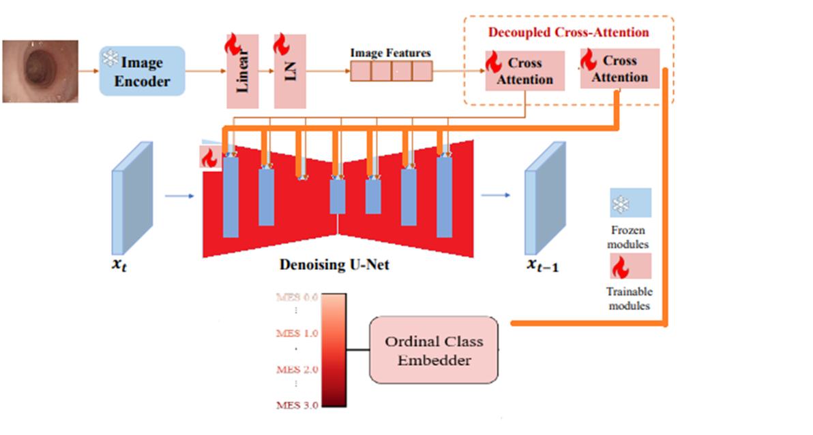
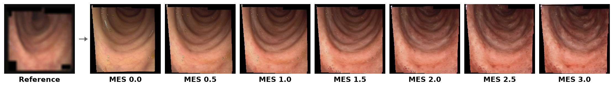

# Patient-Conditioned Ordinal Diffusion for Progressive Medical Image Synthesis

This repository implements a patient-conditioned ordinal diffusion framework for synthesizing disease progression sequences in medical imaging. The approach integrates IP-Adapter-based image conditioning with Additive Ordinal Embeddings (AOE) within a Stable Diffusion architecture, enabling the generation of anatomically consistent disease progression while maintaining ordinal severity relationships.

## Architecture Overview



The framework extends Stable Diffusion v1.4 with two conditioning pathways:
- **Ordinal Conditioning (AOE):** Encodes disease severity as cumulative embeddings, where higher severity levels incorporate features from all lower levels
- **Patient Conditioning (IP-Adapter):** Extracts patient-specific anatomical features from reference images via CLIP encoder and injects them through decoupled cross-attention

## Disease Progression Examples



Given a reference colonoscopy image, the model generates smooth transitions across Mayo Endoscopic Score (MES) levels 0-3 while preserving patient-specific anatomical features.

## Project Structure

```
progressive-stable-diffusion/
├── configs/
│   ├── train.yaml              # Base diffusion training config
│   └── train_classifier.yaml   # MES classifier training config
├── src/
│   ├── models/
│   │   ├── diffusion_module.py      # Base diffusion module
│   │   ├── diffusion_module_ip.py   # IP-Adapter integrated module
│   │   ├── ordinal_embedder.py      # BOE/AOE implementations
│   │   └── image_encoder.py         # CLIP encoder + projection
│   ├── pipelines/
│   │   ├── training_pipeline.py     # Training entry point
│   │   ├── inference_pipeline_ip.py # Patient-conditioned inference
│   │   └── evaluation_pipeline_ip_compare.py  # Model evaluation
│   ├── classification/
│   │   ├── model.py    # ResNet classifier for MES
│   │   ├── dataset.py  # LIMUC datamodule
│   │   └── train.py    # Classifier training script
│   └── data/
│       └── limuc_datamodule.py  # LIMUC dataset handling
├── data/
│   └── limuc/processed_data_scale1/  # Preprocessed LIMUC dataset
└── outputs/                          # Training outputs and checkpoints
```

## Installation

```bash
# Clone the repository
git clone https://github.com/umutdundar99/progressive-stable-diffusion.git
cd progressive-stable-diffusion

# Create conda environment
conda create -n stable python=3.10
conda activate stable

# Install dependencies
pip install -e .

# Optional: Install development dependencies
pip install -e ".[dev]"
```

## Usage

### Training the Diffusion Model

```bash
# Train with IP-Adapter integration
python -m src.main --config configs/train.yaml

# Override specific parameters
python -m src.main --config configs/train.yaml \
    training.max_steps=50000 \
    dataset.batch_size=8
```

### Inference: Patient-Conditioned Progression

Generate disease progression for a specific patient image:

```bash
python -m src.pipelines.inference_pipeline_ip \
    --checkpoint path/to/checkpoint.ckpt \
    --structure-image path/to/patient_image.png \
    --guidance-scale 3.0 \
    --mes-steps 13 \
    --output-dir outputs/progression
```

**Key arguments:**
- `--structure-image`: Reference patient image for anatomical conditioning
- `--guidance-scale`: CFG strength (optimal: 3.0)
- `--mes-steps`: Number of MES levels to generate (13 for smooth interpolation)
- `--zero-image`: Disable image conditioning (AOE-only mode)
- `--no-blur`: Use raw images instead of blurred for conditioning

### Evaluation

Compare multiple model configurations:

```bash
python -m src.pipelines.evaluation_pipeline_ip_compare \
    --num-samples-per-class 50 \
    --guidance-scales 0.0 1.0 2.0 3.0 5.0 \
    --sampling-steps 50
```

### Training MES Classifier

Train a ResNet classifier for downstream evaluation:

```bash
python -m src.classification.train --config configs/train_classifier.yaml
```

## Model Configurations

Three model variants are provided for ablation study:

| Model | Blur | γ_dom | γ_non | Description |
|-------|------|-------|-------|-------------|
| Model A | Yes | 1.0 | 1.0 | Uniform weighting + blur |
| Model B | Yes | 1.5 | 0.5 | Frequency-aware + blur |
| Model C | No | 1.0 | 1.0 | Uniform weighting, no blur |

**Frequency-aware weighting** (`γ_dom=1.5`, `γ_non=0.5`) emphasizes image conditioning in high-resolution U-Net layers (anatomical details) while reducing it in low-resolution layers (disease patterns).

## Key Features

- **Ordinal Embeddings:** AOE ensures severity level monotonicity through cumulative embedding design
- **Resolution-Aware Conditioning:** Separate control over anatomical features (high-res) and disease patterns (low-res)
- **Joint Fine-tuning:** Both UNet and IP-Adapter modules are trained on medical imaging data
- **EMA Weights:** Exponential moving average for stable generation
- **Classifier-Free Guidance:** Dual guidance for ordinal and image conditioning

## Evaluation Metrics

- **FID:** Fréchet Inception Distance (distributional similarity)
- **IS:** Inception Score (quality and diversity)
- **LPIPS:** Learned Perceptual Image Patch Similarity (diversity)
- **SSIM:** Structural Similarity Index
- **QWK:** Quadratic Weighted Kappa (ordinal consistency, for classifier)

## Dataset

Experiments use the LIMUC (Labeled Images for Ulcerative Colitis) dataset with Mayo Endoscopic Score annotations:

| Split | MES 0 | MES 1 | MES 2 | MES 3 |
|-------|-------|-------|-------|-------|
| Train | 4,149 | 2,010 | 823 | 579 |
| Val | 980 | 518 | 205 | 107 |
| Test | 976 | 524 | 226 | 179 |

## Citation

```bibtex
@article{dundar2026patient,
  title={Patient-Conditioned Ordinal Diffusion Models with IP-Adapter for Progressive Medical Image Synthesis},
  author={D{\"u}ndar, Umut},
  journal={arXiv preprint},
  year={2026}
}
```

## Acknowledgments

This work builds upon:
- [Stable Diffusion](https://github.com/CompVis/stable-diffusion) by CompVis
- [IP-Adapter](https://github.com/tencent-ailab/IP-Adapter) by Tencent AI Lab
- Ordinal-aware diffusion framework by Kurt et al.

## License

MIT License
