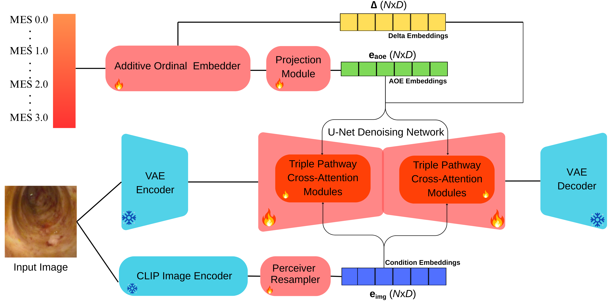
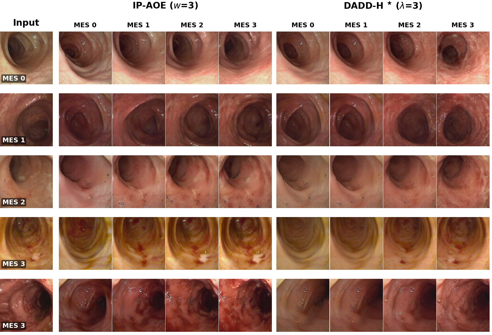

# Synthesizing Longitudinal Ulcerative Colitis Progression via Disentangled Latent Diffusion (DADD)

This repository implements the **Disentangled Anatomy-Disease Diffusion (DADD)** framework for synthesizing longitudinal medical images at controllable disease stages while preserving patient-specific anatomy. This approach is targeted toward ulcerative colitis endoscopy, where severity follows a continuous ordinal progression along the Mayo Endoscopic Score (MES).

## Architecture Overview



The framework resolves the inherent entanglement of patient anatomy and pathological textures by forcing anatomy and disease embeddings to interact.

### Key Innovations

1. **Feature Purifier (Cross-Attention based Disease Erasure):** A cross-attention mechanism that identifies pathological channels by querying image tokens with the Additive Ordinal Embedder (AOE), gating them out to yield a purified anatomical representation.
2. **Frequency-Aware Triple-Pathway Cross-Attention:** A split-injection attention mechanism with fixed frequency-aware routing gates across U-Net layers. It confines disease edits to fine-texture scales while preserving structural identity.
3. **Delta Steering:** A training-free, single-pass alternative to Classifier-Free Guidance (CFG). This signal is derived from the projected AOE difference and provides signed, magnitude-proportional control over severity shifts.

## Disease Progression Comparison: DADD vs IP-AOE



*Comparison demonstrating the difference between the baseline IP-AOE (with guidance weight $w=3$) and our proposed DADD approach (with target delta scalar $\lambda=3$). DADD maintains robust consistency in the structural layout (e.g. mucosal folds) while successfully rendering severity shifts.*

## Project Structure

```
progressive-stable-diffusion/
├── configs/
│   ├── train.yaml              # Base diffusion training config
│   └── train_classifier.yaml   # MES classifier training config
├── paper/                      # Figures and generated outcomes
├── src/
│   ├── models/
│   │   ├── diffusion_module.py      # Base diffusion module
│   │   ├── diffusion_module_ip.py   # IP-Adapter integrated module
│   │   ├── ordinal_embedder.py      # BOE/AOE implementations
│   │   └── image_encoder.py         # CLIP encoder + projection
│   ├── pipelines/
│   │   ├── training_pipeline.py     # Training entry point
│   │   ├── inference_pipeline_ip.py # Patient-conditioned inference
│   │   └── evaluation_pipeline_ip_compare.py  # Model evaluation
│   ├── classification/
│   │   ├── model.py    # ResNet classifier for MES
│   │   ├── dataset.py  # LIMUC datamodule
│   │   └── train.py    # Classifier training script
│   └── data/
│       └── limuc_datamodule.py  # LIMUC dataset handling
├── data/
│   └── limuc/processed_data_scale1/  # Preprocessed LIMUC dataset
└── outputs/                          # Training outputs and checkpoints
```

## Installation

```bash
# Clone the repository
git clone https://github.com/umutdundar99/progressive-stable-diffusion.git
cd progressive-stable-diffusion

# Create conda environment
conda create -n stable python=3.10
conda activate stable

# Install dependencies
pip install -e .

# Optional: Install development dependencies
pip install -e ".[dev]"
```

## Usage

### Training the Diffusion Model

```bash
# Train with DADD integration
python -m src.main --config configs/train.yaml

# Override specific parameters
python -m src.main --config configs/train.yaml \
    training.max_steps=50000 \
    dataset.batch_size=8
```

### Inference: Patient-Conditioned Progression

Generate disease progression for a specific patient image:

```bash
python -m src.pipelines.inference_pipeline_ip \
    --checkpoint path/to/checkpoint.ckpt \
    --structure-image path/to/patient_image.png \
    --guidance-scale 3.0 \
    --mes-steps 13 \
    --output-dir outputs/progression
```

**Key arguments:**
- `--structure-image`: Reference patient image for anatomical conditioning
- `--guidance-scale`: Strength scaler for transitions e.g., $\lambda=3.0$
- `--mes-steps`: Number of MES levels to generate (13 for smooth interpolation)

### Evaluation

Compare multiple model configurations:

```bash
python -m src.pipelines.evaluation_pipeline_ip_compare \
    --num-samples-per-class 50 \
    --guidance-scales 0.0 1.0 2.0 3.0 5.0 \
    --sampling-steps 50
```

### Training MES Classifier

Train a ResNet classifier for downstream evaluation:

```bash
python -m src.classification.train --config configs/train_classifier.yaml
```

## Citation

```bibtex
@article{dundar2026patient,
  title={Synthesizing Longitudinal Ulcerative Colitis Progression via Disentangled Latent Diffusion},
  author={D{\"u}ndar, Umut and Temizel, Alptekin},
  journal={arXiv preprint},
  year={2026}
}
```

## Acknowledgments

This work builds upon:
- [Stable Diffusion](https://github.com/CompVis/stable-diffusion) by CompVis
- [IP-Adapter](https://github.com/tencent-ailab/IP-Adapter) by Tencent AI Lab
- Ordinal-aware diffusion framework by Kurt et al.

## License

MIT License
